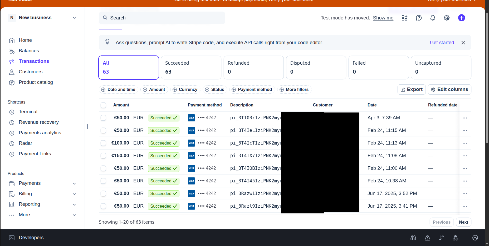
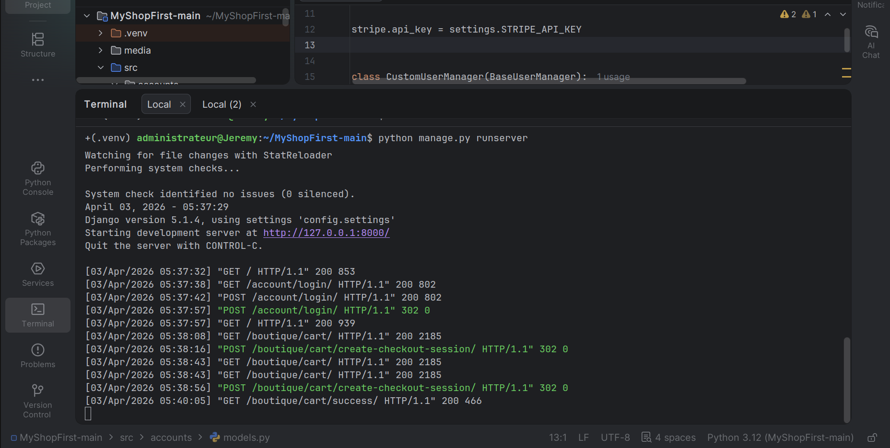

🌿 The Nature Shop
Une application e-commerce robuste construite avec Django 5.1, mettant en œuvre un système d'authentification personnalisé et une intégration complète du tunnel de paiement Stripe.

🚀 Fonctionnalités clés
Authentification Personnalisée : Utilisation d'un modèle Shopper basé sur l'email comme identifiant unique (au lieu du username classique).

Gestion du Panier : Ajout, modification et suppression d'articles en temps réel.

Intégration Stripe : Tunnel de paiement sécurisé avec gestion des sessions de checkout et pages de succès/annulation.

Architecture Propre : Séparation claire entre la logique métier (boutique), l'authentification (accounts) et la configuration globale.

## 📸 Aperçu du projet

### Le Panier & Catalogue

### Paiement Sécurisé via Stripe

### Confirmation de Commande

### Log du terminal

🛠️ Stack Technique
Framework : Django 5.1.4

Base de données : SQLite (parfait pour le développement et la démo)

Paiement : Stripe API (python-stripe)

Environnement : Python 3.12 + Virtualenv