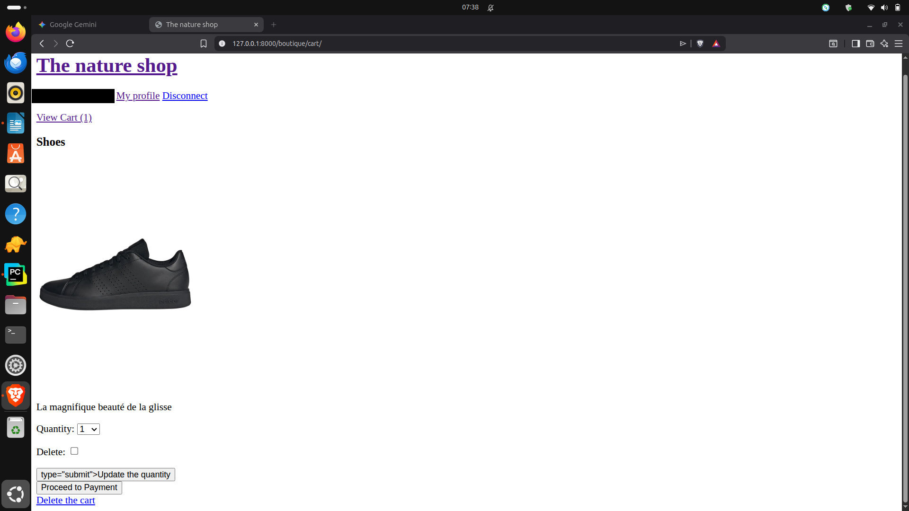
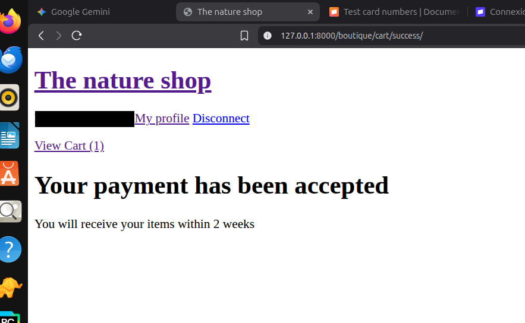

# The Nature Shop


A small e-commerce demo built with Django 5.2: email-based authentication, a shopping cart, and a Stripe Checkout payment flow.

## Features

- **Email authentication:** a custom `Shopper` user model that logs in with an email address instead of a username.
- **Shopping cart:** add products, change quantities, and remove items.
- **Shipping addresses:** each user can save and manage delivery addresses.
- **Stripe Checkout:** hosted payment page created from the cart, with success and cancel pages. The cart is emptied after a successful payment.
- **Tests and CI:** pytest tests, run automatically by GitHub Actions on every push.

## Screenshots

### Cart

[](screenshots/screenshot_cart_anonyme.png)

### Order confirmation

[](screenshots/screenshot_success_anonyme.png)

## Tech stack

- Python 3.12
- Django 5.2
- SQLite
- Stripe API (`stripe` Python package)
- Pillow, django-environ, iso3166
- pytest and pytest-django

## Getting started

```bash
git clone https://github.com/Mountainbluesun/My_Shop_first-.git
cd My_Shop_first-
python3 -m venv .venv
source .venv/bin/activate
pip install -r requirements.txt
cp .env.example .env
```

Open `.env` and fill in your own values:

- `SECRET_KEY`: any long random string
- `STRIPE_API_KEY`: a secret key from your Stripe account (test mode)
- `ENDPOINT_SECRET`: a Stripe webhook signing secret

Then create the database and start the server:

```bash
python manage.py migrate
python manage.py createsuperuser
python manage.py runserver
```

Create your products in the Django admin at `/admin/`. Each product needs the ID of a Stripe price (`price_...`) created in your Stripe dashboard, otherwise checkout cannot bill it.

## Running the tests

```bash
pip install pytest pytest-django
pytest
```

## Limitations

- Demo project: Stripe runs in test mode only, with SQLite as the database.
- Payment is verified when the customer returns to the success page: the server retrieves the Stripe Checkout Session and only finalises the order if it is paid and belongs to the logged-in user. If the customer closes the browser before returning, the order is not finalised, because no webhook handler is implemented. A production version should finalise orders from a Stripe webhook (the `ENDPOINT_SECRET` setting is already in place for it).
- Stripe webhooks cannot reach a local development server, so they are not used here.